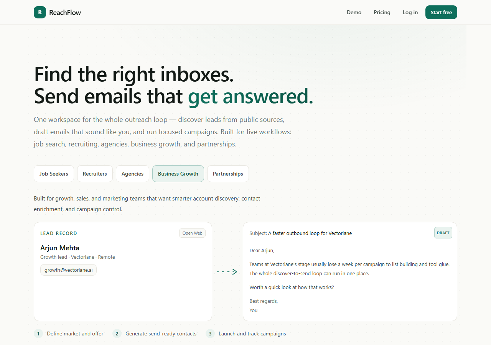
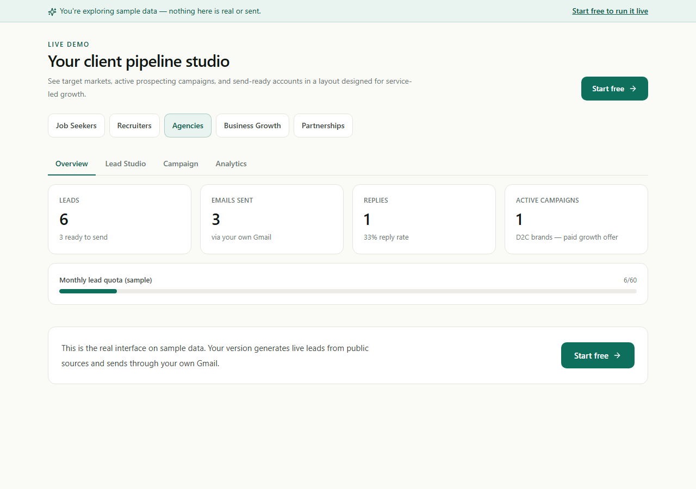

# ReachFlow

**One workspace for the whole cold-outreach loop — discover leads from public
sources, draft emails that sound like you, run compliant campaigns, and track
what works.** ReachFlow reshapes itself around five different jobs:
**job seekers, recruiters, agencies, business growth, and partnerships** — same
engine, a different product per vertical.



> A multi-tenant AI outreach SaaS that runs for **₹0/month** on free tiers, is
> **portable to any Docker host in under 30 minutes**, and treats cold-email
> **compliance as a feature, not an afterthought**. Built solo, end to end:
> custom auth, ported-and-hardened scrapers, an AI drafting engine, payments,
> tests, CI, encrypted backups, and a runbook.

---

## The product, on sample data

The public demo runs the **real interface** on labeled sample data — no signup,
nothing sent:



Every number here is sample data and says so. That's the rule the whole product
follows (see [Honesty](#honesty), below): no invented metrics, logos, or
testimonials, anywhere.

## What it does

1. **Discover** — generate leads from public sources via a per-vertical
   strategy (job portals, the open web, Maps, Apollo), enriched with a
   public-email finder. Runs as a bounded, resumable background job with live
   progress.
2. **Draft** — Groq-backed AI writes a personalized email per lead using a
   vertical-specific prompt, with a deterministic template fallback if the LLM
   is unavailable.
3. **Send** — compliant campaigns through the user's *own* Gmail: working
   one-click unsubscribe, suppression of unsubscribed/bounced contacts, a
   sender-identity footer on every email, and daily send caps.
4. **Track** — analytics: KPIs, a funnel, daily-send trend, source/industry
   breakdowns, CSV export.

The five-vertical concept is the differentiator: landing copy, pricing,
dashboard layout, lead-gen strategy, and AI prompts all change with the vertical.

## Architecture

Production runs on free managed tiers; the **same code** runs anywhere via
Docker. That dual-target is deliberate — managed for ₹0 convenience, compose for
sovereignty.

```
                 ┌───────────────────────── production (₹0, D-001) ─────────────────────────┐
  Browser ─────► │  Vercel (Next.js web)  ──/api/proxy──►  Render (FastAPI)  ──►  Supabase   │
                 │       ▲ same-origin proxy, Origin-checked        ▲ our own JWT auth   (PG)  │
                 │  GitHub Actions: cron-tick (drives jobs) · nightly encrypted backup        │
                 │  UptimeRobot: keep-alive + downtime alerts · Umami Cloud: privacy analytics │
                 └───────────────────────────────────────────────────────────────────────────┘

  escape hatch:  git clone + .env + `docker compose up`  →  Postgres · Redis · api · worker · web
                 (real Celery worker + beat; restore a backup; live in < 30 min — see CUTOVER.md)
```

- **Web** — Next.js 15 (App Router) + React 19 + Tailwind v4 (design tokens in
  `@theme`), server-rendered marketing, a hand-rolled component library, no
  client-side data leakage (everything goes through an Origin-checked proxy).
- **API** — FastAPI + SQLAlchemy 2.0 + Alembic. **Custom auth** (no Supabase
  Auth): argon2id passwords, 15-min HS256 access JWTs, opaque **rotating
  refresh tokens with family reuse-revocation**, one-time email/reset tokens.
- **Jobs** — dual-mode: a real Celery worker in compose; on Render-free, signed
  `/internal/cron/tick` calls from GitHub Actions drive the same idempotent,
  resumable work.
- **Security** — Fernet-encrypted stored secrets, HMAC-verified Cashfree
  webhooks, rate limiting (Redis with in-memory fallback), CSP + security
  headers, strict CORS, and **every query scoped to the authenticated user**.

Why this stack instead of the original self-hosted plan: see
[`docs/DECISIONS.md`](docs/DECISIONS.md) (D-001) and
[`docs/PLAN_AMENDMENT_OLD_STACK.md`](docs/PLAN_AMENDMENT_OLD_STACK.md).

## Repository layout

```
apps/api     FastAPI service — routers, services (lead-gen, AI, send, payments), models, Alembic, tests
apps/web     Next.js app — marketing, auth, the five app surfaces, components/ui, the proxy
infra        backup-now.sh · restore.sh · deploy.sh · server-setup.sh (compose/self-host)
.github      CI gate · cron-tick · nightly backup workflows
docs         the docs index below
```

## Run it locally

**With Docker (one command — the portability story):**

```bash
git clone https://github.com/Priyam-Dutta-code/reachflow.git
cd reachflow
cp .env.example .env      # fill the secrets marked in the file
docker compose -f compose.dev.yml up
# web → http://localhost:3000   ·   api → http://localhost:8000/health
```

**Without Docker (two terminals):**

```bash
# API
cd apps/api && python -m venv .venv && . .venv/Scripts/activate   # (or source .venv/bin/activate)
pip install -r requirements.txt
alembic upgrade head && uvicorn app.main:app --reload

# Web
cd apps/web && npm install && npm run dev
```

Tests also run without Docker (SQLite): `cd apps/api && pytest`.

## Configuration

All environment variables are documented in [`.env.example`](.env.example)
(Appendix B of the master plan). Nothing real is committed — `.env` is
server-side only. Payments and live email stay **disabled-safe** until their
credentials are supplied. Deploy-time setup of every variable is in
[`docs/SETUP_RENDER_VERCEL.md`](docs/SETUP_RENDER_VERCEL.md).

## Operations

| Task | Command / doc |
|---|---|
| Deploy | push to `main` → Vercel + Render auto-build ([RUNBOOK](docs/RUNBOOK.md)) |
| Backup (encrypted, offsite) | `./infra/backup-now.sh` |
| Restore (drill or real) | `./infra/restore.sh <file> [--drill]` |
| Rollback | platform dashboard "Redeploy" ([RUNBOOK](docs/RUNBOOK.md#rollback)) |
| Cutover / portability drill | [`docs/CUTOVER.md`](docs/CUTOVER.md) |

## Documentation

| Doc | What |
|---|---|
| [API.md](docs/API.md) | Endpoint reference (41 endpoints, 10 routers) |
| [DESIGN_SYSTEM.md](docs/DESIGN_SYSTEM.md) | Tokens, components, motion |
| [RUNBOOK.md](docs/RUNBOOK.md) | Day-2 ops: deploy, rollback, logs, backups, secret rotation, recovery |
| [SETUP_RENDER_VERCEL.md](docs/SETUP_RENDER_VERCEL.md) | First-time deploy (Render + Vercel + Supabase + Actions + UptimeRobot) |
| [CUTOVER.md](docs/CUTOVER.md) | V1→V2 cutover + the <30-min portability drill |
| [DECISIONS.md](docs/DECISIONS.md) | Decision log (D-001 stack, D-003 fresh start, …) |
| [SALVAGE_MAP.md](docs/SALVAGE_MAP.md) | What was ported / rewritten / dropped from V1 |
| [AUDIT.md](docs/AUDIT.md) | V1 baseline audit + the final Extraordinary-bar audit with evidence |
| [QUALITY.md](docs/QUALITY.md) | Security / a11y / responsive / perf evidence |
| [PLAYBOOK.md](docs/PLAYBOOK.md) · [LAUNCH.md](docs/LAUNCH.md) | Dogfood loop · first-customers playbook |
| Self-host | [SETUP_ORACLE.md](docs/SETUP_ORACLE.md) · [SETUP_CLOUDFLARE.md](docs/SETUP_CLOUDFLARE.md) · [CADDY_FALLBACK.md](docs/CADDY_FALLBACK.md) |

## Quality bar

Engineering evidence in [`docs/QUALITY.md`](docs/QUALITY.md) and the final audit
in [`docs/AUDIT.md`](docs/AUDIT.md):

- Lighthouse (local prod build): marketing **99** perf / **100** a11y / 100 SEO;
  app pages **94** perf / **100** a11y.
- **79 API tests** green; `ruff` clean; CI gates every PR
  (ruff + pytest + migrations · web typecheck + build).
- Flawless 360 → 1536px; tables become cards on mobile; ≥44px taps; zero console
  errors; loading skeletons + designed empty states everywhere.
- Signup → first generated leads in **under 2 minutes**.

## Honesty

This is a credibility product, built by an engineer who is also job-hunting, so
the rule is absolute: **no fabricated numbers, testimonials, or logos —
anywhere.** Capabilities are described in honest terms ("finds public hiring
signals across several sources"); real metrics appear only once they exist; the
demo's sample data is labeled as sample data. One fake number would poison the
whole thing.

## Status

Built ground-up over phases 0–13 (V1 → V2). The live cutover is documented and
ready; the deployed-CDN Lighthouse re-measure, the cold-start timing, and the
timed Docker portability drill are the post-deploy closeout (see
[`docs/AUDIT.md`](docs/AUDIT.md) for what's proven vs. deploy-gated). The
original engineering plan lives in
[`REACHFLOW_V2_MASTER_PLAN.md`](REACHFLOW_V2_MASTER_PLAN.md).
